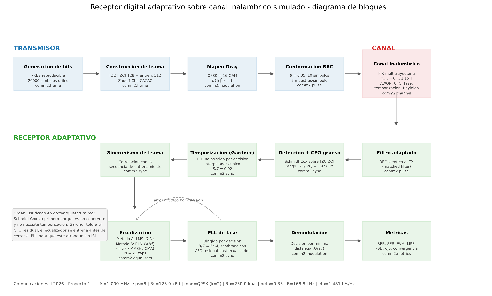
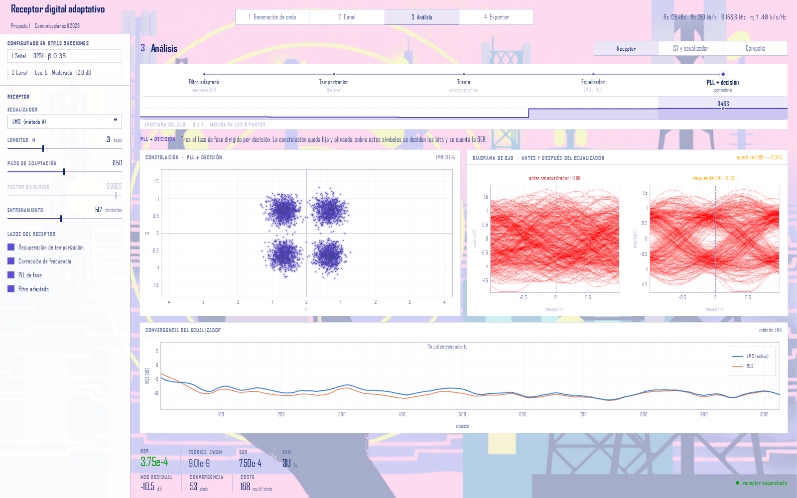
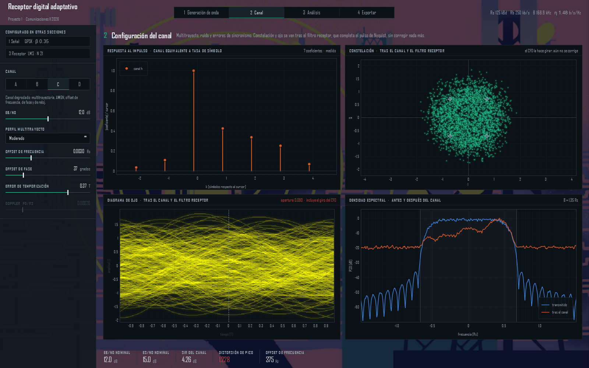

# Receptor digital adaptativo sobre canal inalámbrico simulado

**Proyecto 1 — Comunicaciones II 2026** · Prof. Dr. Ing. Carlos A. Medina C.

Simulación completa de un enlace digital en banda base compleja: transmisor con
conformación RRC, canal con multitrayectoria, AWGN y errores de sincronización, y
receptor adaptativo con recuperación de temporización, de portadora y ecualización
LMS / RLS. Implementado en Python puro sobre NumPy/SciPy.



---

## Instalación

Requiere **Python 3.11**.

```bash
python -m venv .venv
.venv\Scripts\activate          # Windows
pip install -e ".[gui]"
```

Dependencias: `numpy`, `scipy`, `matplotlib`, `pandas` (y `PySide6` + `pyqtgraph` para la interfaz).

## Banco de pruebas



Aplicación de escritorio para conducir el enlace en vivo. Doble clic en
**`Banco de pruebas.bat`**, o desde la línea de órdenes:

```bash
python -m app
```

Sin navegador, sin servidor y sin puerto: es una ventana Qt.

La idea que la organiza: **la cadena TX → canal → RX es la barra de
navegación**. Se elige un punto de derivación y los instrumentos muestran la
señal *ahí*. Los cinco puntos a tasa de símbolo contienen los mismos símbolos,
índice a índice, de modo que al cambiar de etapa cada punto se interpola desde
su posición anterior hasta la nueva: se ve el símbolo *k* salir del borrón de
ISI y aterrizar sobre su punto de la constelación. Debajo de los nodos va el
perfil de apertura del ojo a lo largo de las ocho etapas — una sola magnitud,
un solo eje — que dibuja de un vistazo el argumento del proyecto: el ojo nace
abierto, el canal lo cierra y el ecualizador lo vuelve a abrir.

Esto es posible por un hecho medido, no por una decisión de interfaz: una
corrida completa de `run_link()` tarda **0,18 s** con 4 000 símbolos, así que el
enlace entero se recalcula mientras se arrastra un control. El trabajo ocurre en
un hilo aparte que descarta las peticiones obsoletas, de modo que al soltar el
control siempre se dibuja el estado final y nunca se acumula cola.

Tres vistas:

| Vista | Qué hace |
|---|---|
| **Banco de pruebas** | Constelación, ojo, espectro y convergencia en los ocho puntos de derivación, con la lectura de BER, SER, EVM, MSE, convergencia y coste. |
| **Campaña** | Los experimentos 1–5 de la guía como barridos que se dibujan mientras se calculan. Los puntos sin errores se dibujan sobre la línea de suelo `1/(k·N)`, marcados como cota y no como valor. |

### Sin interfaz

Para quedarse solo con las imágenes, sin abrir nada: doble clic en
**`Guardar imagenes.bat`**, o

```bash
python -m app --export salida --escenario C --ebn0 12 --eq lms
```

Corre la simulación, renderiza los instrumentos fuera de pantalla y escribe la
cadena, las ocho constelaciones, los ocho diagramas de ojo, el espectro,
la convergencia y un `medidas.csv` con BER, SER, EVM, MSE, convergencia, coste y
la apertura del ojo en cada punto. No sustituye a `experiments/run_all.py`, que
genera las figuras del informe en matplotlib: esto genera las del instrumento,
que son las de la presentación.

### Tema

El tema claro es el de serie. El fondo es la ilustración de `app/assets/fondo.png`
bajo un velo blanco; sus tintas planas se midieron sobre la propia imagen y
gobiernan el chasis y el color de la traza de señal. Las series comparadas usan
en cambio la paleta documentada de visualización de datos, porque la ilustración
—medido— no puede darlas: sus tonos se agrupan en 247/265/281/286, todos
azul-violeta, y como conjunto categórico no separa cinco series.

Para portátil o sala a oscuras hay un instrumento de fósforo:

```bash
python -m app --tema oscuro
```



## Uso rápido

```bash
cd experiments
python run_all.py            # toda la campaña: tablas + figuras
python run_all.py 1 3        # solo los experimentos 1 y 3
python run_all.py --lista    # ver qué hay disponible
```

Ejemplo mínimo de la API:

```python
from comm2 import SystemParams, ReceiverConfig, EqualizerConfig, scenarios, run_link

p  = SystemParams(mod="qpsk", n_payload=20000)
rx = ReceiverConfig(eq=EqualizerConfig(kind="rls", n_taps=21, lam=0.999))
r  = run_link(p, scenarios.scenario_c(p, ebn0_db=12.0), rx)

print(r.report())
# [C] QPSK Eb/N0=12.0 dB eq=rls -> BER=2.750e-04 SER=5.500e-04 EVM=29.51% MSE=-10.60 dB
```

---

## Estructura

```
src/comm2/          biblioteca de simulación
  params.py         parámetros del sistema, del receptor y del ecualizador
  modulation.py     BPSK/QPSK/8PSK/16-64-256QAM con Gray + BER y SER teóricas
  pulse.py          RRC analítico, filtro adaptado, interpoladores fraccionarios
  frame.py          preámbulo Zadoff-Chu, entrenamiento, carga útil
  channel.py        AWGN, multitrayectoria FIR, Rayleigh-Jakes, CFO, fase, reloj
  sync.py           Schmidl-Cox, Gardner, sincronismo de trama, PLL de fase
  equalizers.py     LMS, RLS, ZF, MMSE, CMA + convergencia y coste computacional
  metrics.py        BER/SER, EVM, MSE, PSD, ojo, eficiencia espectral, SNR ciega
  link.py           cadena TX-canal-RX completa y Monte Carlo
  scenarios.py      escenarios A, B, C y D
  plots.py          figuras normalizadas para el informe

app/                banco de pruebas de escritorio (PySide6 + pyqtgraph)
  theme.py          paleta, tipografía y hoja de estilo del instrumento
  engine.py         hilo de simulación y extracción de puntos de derivación
  signalpath.py     la cadena como barra de navegación + perfil del ojo
  displays.py       constelación, ojo, espectro y convergencia
  controls.py       rail de parámetros con su lógica de activación
  bench.py          vista en vivo; campaign.py  barridos

experiments/        campaña de simulación (un script por experimento)
tests/              pruebas de la biblioteca y de reproducibilidad de la campaña
docs/               arquitectura, justificación de parámetros, bibliografía
results/            data/*.csv y figures/*.png generados
```

## Correspondencia con la guía

| Requisito de la guía | Dónde está |
|---|---|
| 4.1 Generación de secuencia digital | `frame.build_frame` |
| 4.2 Trama con preámbulo/entrenamiento | `frame.zadoff_chu`, `frame.pn_qpsk` |
| 4.3 Modulación QPSK | `modulation.Modulation("qpsk")` |
| 4.4 Segunda modulación | 16-QAM (además 8PSK y 64-QAM) |
| 4.5 Conformación RRC | `pulse.rrc_filter` |
| 4.6 Canal AWGN | `channel.add_awgn` |
| 4.7 Canal multipath | `channel.MultipathProfile`, `channel.PROFILES` |
| 4.8 Perturbación adicional | CFO + fase + temporización + deriva de reloj |
| 4.9 Filtro receptor | `pulse.matched_filter` |
| 4.10 Ecualización | `equalizers` (LMS, RLS, ZF, MMSE, CMA) |
| 4.11 Demodulación | `Modulation.demodulate` |
| 4.12 Estimación de BER | `metrics.bit_error_rate`, `link.monte_carlo` |
| 7. Escenarios A/B/C | `scenarios` (+ D con Rayleigh) |
| 8. Dos estrategias de ecualización | Método A = LMS, método B = RLS |
| 9. Experimentos 1–5 | `experiments/exp1..exp5` |
| 10. Métricas | `metrics` |
| 12. Diagrama de bloques (semana 1) | `experiments/exp0_diagrama_bloques.py` |

---

## Resultados principales

**Experimento 1 — validación en AWGN.** La BER simulada cae sobre la teórica en
todo el rango: razón mediana simulada/teórica de 1,03 para QPSK. Es la garantía de
que la contabilidad de Eb/N0, la normalización del RRC y el mapeo Gray son
correctos antes de introducir cualquier degradación.

**Experimento 2 — efecto de la ISI.** Con el canal normalizado a energía unitaria,
la SNR media no cambia; sin embargo la apertura del ojo pasa de 0,76 (canal plano)
a 0,08 (perfil severo) y la BER a 14 dB salta de 0 a 4,6·10⁻¹. Toda la degradación
es distorsión, no pérdida de potencia.

**Experimento 3 — ecualización.** Escenario B (perfil `moderate`), QPSK a 14 dB,
con μ y λ ya ajustados en el propio experimento:

| Método | BER | MSE residual | Conv. a −9 dB | Conv. a −12 dB | Mult. reales/símbolo |
|---|---|---|---|---|---|
| Sin ecualizar | 6,1·10⁻² | −3,9 dB | nunca | nunca | 0 |
| **LMS (método A)** | 2,5·10⁻⁵ | −12,2 dB | 78 símbolos | 231 símbolos | **168** · `O(N)` |
| **RLS (método B)** | < 2,5·10⁻⁵ | −11,5 dB | **60 símbolos** | **125 símbolos** | 7 392 · `O(N²)` |
| ZF (canal conocido) | 2,5·10⁻⁵ | −12,3 dB | 4 símbolos | 124 símbolos | 84 |
| MMSE (canal conocido) | < 2,5·10⁻⁵ | −12,3 dB | 5 símbolos | 124 símbolos | 84 |
| CMA (ciego) | 7,5·10⁻⁵ | −10,3 dB | 1 310 símbolos | 4 755 símbolos | 172 |

El RLS converge en ≈ 2N iteraciones (41 símbolos con N = 21), tal como predice la
teoría, y esa cifra **no depende de λ**: λ gobierna la capacidad de seguimiento,
no la velocidad de adquisición. El LMS normalizado con μ = 0,5 llega al mismo MSE
residual —de hecho ligeramente mejor— pero tarda casi el doble, y a cambio cuesta
**44× menos multiplicaciones por símbolo**.

**Experimento 5 — coste de la eficiencia espectral.** Eb/N0 necesario para
BER = 10⁻³:

| Modulación | η [b/s/Hz] | Escenario A | Escenario C | Penalización |
|---|---|---|---|---|
| QPSK | 1,48 | 6,7 dB | 11,2 dB | +4,4 dB |
| 8PSK | 2,22 | 10,2 dB | 14,6 dB | +4,6 dB |
| 16-QAM | 2,96 | 10,7 dB | 18,1 dB | +7,6 dB |
| 64-QAM | 4,44 | 15,0 dB | **no alcanza 10⁻³** | — |

En AWGN la penalización de implementación es de sólo 0,1–0,2 dB para todas las
modulaciones. En el canal degradado, en cambio, el coste crece con el orden: la
ISI residual que deja un ecualizador lineal de 21 taps (MSE ≈ −12 dB) es
tolerable para QPSK pero no para 64-QAM, cuya distancia mínima exige un MSE por
debajo de −20 dB.

**Experimento 4 — dos resultados que confirman la teoría.** El límite medido de
adquisición de frecuencia cae entre 0,6 % y 0,8 % de Rs, y el límite teórico de
Schmidl-Cox es `Rs/(2L) = 0,78 %`: la sincronización funciona con BER < 10⁻⁵ hasta
750 Hz y colapsa a 0,50 en 1 000 Hz. Y en el escenario D (Rayleigh) el factor de
olvido deja de ser irrelevante — con `fD/Rs = 5·10⁻⁵`, λ = 0,99 da BER 4,8·10⁻³
frente a 0,25 con λ = 0,9999: **50× de diferencia sólo por la memoria del
algoritmo**, mientras que en canal estático λ no afectaba a nada.

**Respuesta a la pregunta central.** Para las condiciones analizadas, el mejor
compromiso es **QPSK con LMS normalizado, N = 21 taps, μ = 0,5 y 512 símbolos de
entrenamiento**: alcanza la BER del MMSE calculado con canal perfectamente
conocido, a **1/44 del coste** del RLS.

Conviene ser preciso sobre cuándo *sí* compensa el RLS, porque el ajuste de μ
cambia mucho la respuesta. Con μ = 0,15 el LMS fallaba por completo con 64
símbolos de entrenamiento y se degradaba al alargar el filtro; con μ = 0,5 ese
problema desaparece y ambos métodos quedan por debajo de 10⁻⁴ en todo el barrido
de N (5–41 taps) y de entrenamiento (64–1 024 símbolos). Lo que queda como ventaja
real del RLS es: converge en la mitad de símbolos (60 frente a 125 para llegar a
−12 dB de MSE), no necesita ajustar ningún paso, y **su factor de olvido es un
grado de libertad que el LMS no tiene** — decisivo en el escenario D, donde elegir
λ correctamente vale 50× en BER.

Sobre la modulación: subir a 16-QAM duplica la eficiencia espectral (1,48 →
2,96 b/s/Hz) por 7,6 dB de potencia adicional en el canal degradado; 64-QAM no es
utilizable con este receptor, porque la ISI residual de un ecualizador lineal de
21 taps (MSE ≈ −12 dB) está muy por encima de los −20 dB que su distancia mínima
exige.

---

## Documentación

- [`docs/arquitectura.md`](docs/arquitectura.md) — diseño del sistema y, sobre
  todo, **por qué el receptor tiene ese orden de bloques**. Incluye los tres
  problemas de diseño no evidentes que aparecieron al medir (normalización de
  Schmidl-Cox en ráfagas, ambigüedad ±L del preámbulo periódico, y el transitorio
  del PLL de segundo orden).
- [`docs/parametros.md`](docs/parametros.md) — cada parámetro con su
  justificación física y, cuando procede, la medición que lo fijó.
- [`docs/referencias.md`](docs/referencias.md) — bibliografía indicando dónde
  interviene cada referencia.

## Pruebas

```bash
python tests/test_comm2.py       # 24 pruebas de la biblioteca  (~1 min)
python tests/test_campana.py     # reproducibilidad de la campana (~8 min)
```

`test_campana.py` ejecuta los siete experimentos de principio a fin con una
carga útil mínima, escribiendo en un directorio temporal. No busca resultados
con sentido estadístico: comprueba que **todas** las rutas de código corren sin
error, incluidas las de generación de figuras — que son las que se quedan sin
probar cuando se retoca una gráfica. Es la garantía de que `run_all.py`
reproduce la campaña entera desde el repositorio limpio.

`test_comm2.py` comprueba propiedades **teóricas**, no valores grabados a mano:
energía unitaria de las constelaciones, distancia de Hamming 1 entre puntos
adyacentes con mapeo Gray, criterio de Nyquist del RRC, autocorrelación ideal de
Zadoff-Chu, que el convenio de ruido produce el Es/N0 pedido, que Schmidl-Cox
localiza el inicio y la frecuencia, que el lazo de Gardner siempre termina, que
ZF/MMSE invierten un canal de fase mínima, que el RLS es estable para todo λ, y
que la BER del escenario A cae sobre la teórica. Si alguien cambia una constante
y rompe la física del modelo, las pruebas fallan.

## Reproducibilidad

Toda la campaña es determinista: la semilla base está en `experiments/_common.py`
(`BASE.seed = 2026`) y cada realización Monte Carlo deriva su propio generador con
un desplazamiento explícito, de modo que las tramas son independientes entre sí y
reproducibles entre ejecuciones.

---

Esto lo terminé el día del sismo 2026 del 9 de octubre jajaja qué miedo.
